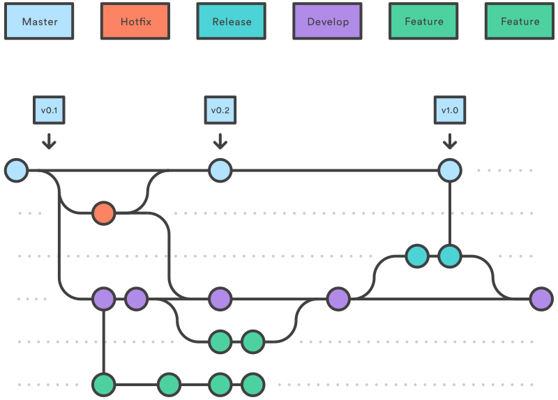
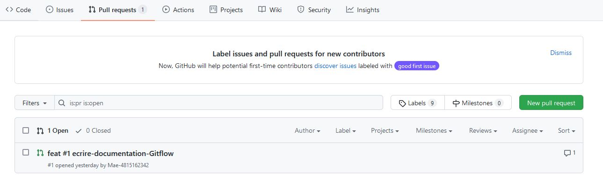
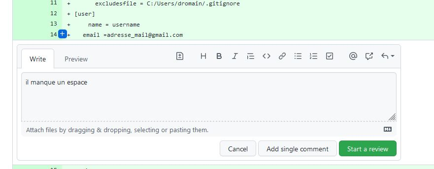
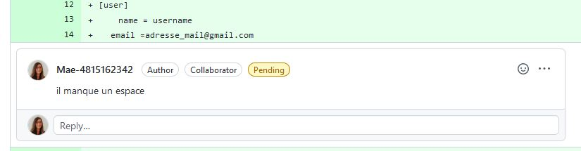
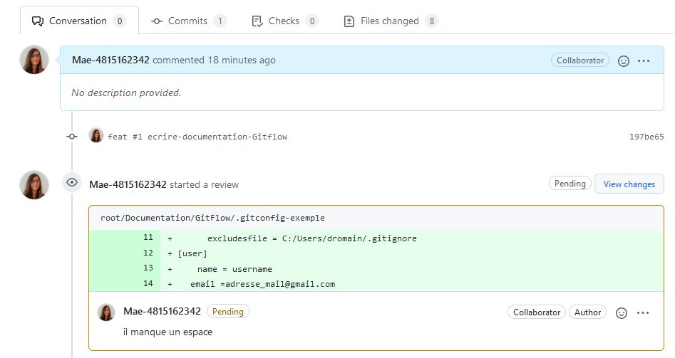

# La méthode Gitflow


>### On ne merge pas la develop dans la master !
>Cela signifierait **la perte de tous les travaux en cours !!!**



>*N'hésitez pas à consulter en parallèles la documentation sur le [suivi de l'avancement des tâches sur Notion](../Notion/Task%20Management%20and%20Communication.md), qui s'appuie en grande majorité sur le Gitflow*

Le principe de la méthode Gitflow repose sur la **copie du répertoire** de l'application et la **gestion de version**. 
>**Une copie du répertoire est appellée branche**.

>**Lorsqu'on effectue une copie d'une branche, on dit qu'on *tire une branche***

>**Lorsqu'on fusionne une branche dans une autre (par exemple pour mettre son travail sur la develop), on dit qu'on *merge dans une branche***

Un projet utilisant Gitflow est généralement découpé en **deux branches principales**:

###### Master:
C'est la branche qui **contient le code source** de l'application **tel qu'il est en production**.

>Dans notre projet elle est nommée *main*

###### Develop
C'est la **copie principale**. C'est à partir de cette branche que sont tirées et mergées les branches des développeurs. Elle n'est jamais mergée directement dans la master.

Et c'est tout ! Toute la méthode Gitflow décrit comment interragir avec ces deux entités dans le cadre d'une **intégration continue**. Dans la suite nous allons voir quelques aspect essentiels de cette méthode lors d'un projet. 

[1.Branches et types de tâches](#1.branches-et-types-de-tâches)

[2.Commits](#2.commits)

[3.Review (Comments)](#3.review-(comments))

[4.Merge](#4.merge)

[5.Releases](#5.releases)


<a name=1.branches-et-types-de-tâches></a>
## 1.Branches et types de tâches

Les branches Gitflow sont représentées en en-tête du document. 
Les principales tâches que vous effectuerez (donc branches que vous tirerez) sont des trois types suivants:

>##### feat:
>>tâche de feature, consiste à l'ajout de fonctionnalités nouvelles dans l'application ou à la refactorisation de fonctionnalité déjà présente mais nécessistant une mise à jour

>##### fix: 
>>tâche de correction des bugs

>##### hotfix: 
>>tâche de fix effectuée **directement à partir de la master ou de release** (branche main)

Il existe un autre type de tâche, exécuté ponctuellement:

>##### release
>>branche tirée spécialement à partir de la develop **en vue d'une livraison sur la master**
Voire la partie sur la [release](#5.releases).

<a name=2.commits></a>
## 2.Commits

Lorsqu'une branche est tirée, elle est **identique à sa branche d'origine**. Il est donc nécessaire d'[effectuer des commits](./Starting%20on%20tasks.md/#3.effectuer-des-commits) régulièrement (points sur chaque branche du schéma).
Un commit correspond à une **version de la branche**. 
Ce sont les commits qui seront soumis à une [pull request](./Starting%20on%20tasks.md/#4.-soumettre-la-branche-à-une-pull-request) lors du merge de la branche. 

Il est possible de **gérer la version**, c'est à dire de faire revenir la branche à des commits antérieurs. 

Pour cela on utilise la commande:
```
git resert --option HEAD~n
```

avec **n** valant le **nombre de commit à annuler** en partant du plus récent et **--option** valant:
* **--soft** : les commits sont annulés, mais les modifications sont conservées (donc visible dans l'onglet *Changement*)
* **--hard** : la branche revient à la version -n.

En pratique une branche aura **un seul commit** mis à jour par un *git commit --amend --no-edit*. Les commandes précédentes ne servent en théorie qu'en cas d'erreur (notament lors des rebases, cela peut arriver d'embarquer des commits appartenant à d'autres développeurs)

<a name=3.review-(comments)></a>
## 3.Review (Commentaires et approbation)

Quand une *pull request* est créée, elle recquiert l'aval des autres développeurs. 

* ##### Review le code d'un autre développeur:

Pour review le code d'une *pull request*, allez dans l'onglet **Pull Request** de Github, et cliquez sur la *pull request* que vous souhaitez review. 



Une fois dans la pull request, allez dans l'onglet **File changes**. C'est là que ce trouvent les modifications apportées au repos. 
Si vous souhaitez ajouter un commentaire sur le code, **cliquez sur la croix bleue qui apparaît au survol d'une ligne de code**.



Tapez votre commentaire. Vous pouvez ensuite choisir entre **Add single comment**, qui laissera un simple commentaire, ou **Start a review** (également disponible tout en haut des fichiers). Ce dernier vous amène dans l'onglet *Conversation*, et vous propose plusieurs options:


>Laisser un commentaire

>Approver le commit: *sera enregistré comme une approbation*

>Réclamer un changement: *mettra en pending le commit, bloquant le merge*

Quel que soit l'option choisie, vous pourrez **visualiser les commentaires** dans le code directement et sur l'onglet *Conversation*



<p></p>



* ##### Résoudre les commentaires dans son commit:

Avant de merger, vous serrez tenu de **résoudre les commentaires bloquant**. Si possible, tenez compte de tous les commentaires. 
Apportez les éventuelles corrections à votre branche, et pusher les dans votre commit, puis validez les commentaires. 

Il faudra également l'aval d'un testeur avant le merge.

>*Procédure de test en attente de la mise en place de l'environement*

<a name=4.merge></a>
## 4.Merge

[Mergez votre branche](./Starting%20on%20tasks.md/#5.-merger-votre-branche-dans-la-develop).

<a name=5.releases></a>
## 5.Releases

Régulièrement, les travaux effectués **sur la develop** doivent être **mis en production sur la master**. Cependant, 
### on ne merge pas la develop dans la master
Cela signifierait **la perte de tous les travaux en cours !!!**
Il va falloir tirer une branche spéciale : une **release**. Celle-ci est nommée *release*, avec un **numéro de version**.
```
Release.v0.1
```
>Il est possible d'effectuer des **hotfix** directement sur la release afin de corriger des bugs de dernière minute.
Sinon, pas de branches de feat ou de fix !

La **release est tirée depuis la develop**. Puis, lors d'une **mise en production** (ou MEP), elle est **mergée dans la master**. La master doit alors être redéployée. 


