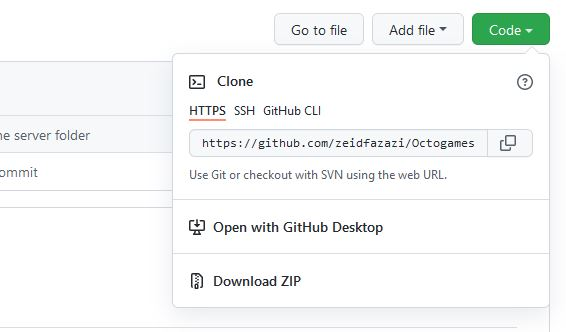

# Installer le Projet Squadro localement

>*Pour les opérations depuis le terminal, il est conseillé d'opérer depuis un terminal intégré à votre IDE*

### Installer les programmes

- [git](http://git-scm.com/download/win) (lien vers la version Windows)
- [KDiff3](https://sourceforge.net/projects/kdiff3/) (permet de visualiser les différences entre la branche locale et la develop)
- [NodeJS](https://nodejs.org/en/)

### Extensions

Sur votre IDE, si cela n'est pas disponible par défaut, installer une extension de contrôle des sources.
N'hésitez pas à installer des extensions supplémentaires, notament les extensions visuelles de Git. 
*En effet, bien que cette documentation effectue toutes les opérations de contrôle et de soumission des branches via des commandes dans le terminal, il peut être plus évident de voir directement les changements via une interface.*
Si vous souhaitez visualiser les changements effectués sur un fichier par d'autres personnes, l'extension **Git History (VSCode)** est recommandée

### Configurer git

Pour fonctionner correctement, **git nécessite un fichier .gitconfig**.
Ce fichier est situé à la racine de l'utilisateur. Bien qu'il soit configurable par ligne de commande, il est plus simple de le remplir manuellement à partir d'un modèle.

**Copiez le fichier *.gitconfig-exemple* à la racine de l'utilisateur (~/)**. Les fichiers du projet devront plus tard être installés sous ce même utilisateur.

**Renommez le fichier en .gitconfig,** et modifiez les champs suivants
```
[user]
    name = username
    email = adresse_mail@gmail.com
``` 

avec votre **nom d'utilisateur Github** et votre **adresse mail**, enregistrez.

Il est aussi possible d'effectuer ces modification depuis le terminal avec les commandes:
```
git config --global user.name "username"
git config --global user.email "adresse_mail@gmail.com"
```

### Récupérer le repos du projet

Sur Github, récupérer les fichiers du projet en cliquant sur **Code** puis **Download zip**.
Effectuer l'extraction du fichier à l'emplacement de votre choix, tant qu'il s'agit d'un répertoire situé dans les dépendances de l'utilisateur qui a le .gitconfig.



Vous pouvez ouvrir le répertoire du projet, **Octogame-Squadro**, dans votre IDE. 

Dans le terminal, placez vous avec *cd* dans ce répertoire.
Il va falloir **cloner le répertoire distant sur Girhub** afin de récupérer les différentes branches et fusionner vos branches locales au cours du projet:

Retournez sur Github et copiez l'adresse HTTPS dans le menu **Code** (il s'agit normalement de https://github.com/zeidfazazi/Octogames-Squadro.git)
Dans le terminal, clonez le repos avec la commande suivante

```
git clone https://github.com/zeidfazazi/Octogames-Squadro.git
```

Le repos est cloné ! Vous pouvez désormais manipuler vos modifications avec les commandes de git. 
Tapez dans le terminal:

```
git branch
```

Normalement, vous obtenez un affichage de la forme (avec ou sans la develop, ça n'a pas d'importance):
```
    develop
    * main
```

L'étoile indique la branche sur laquelle vous vous trouvez. Placez vous sur la develop et assurez-vous d'être à jour par rapport à Github en tapant:

```
git checkout develop
git pull
```

Vous pouvez enfin naviguer dans vos fichiers et effectuer les modifications ! 

>*Une fois que vous aurez suivi la procédure d'installation, le projet est prêt pour le développement. Veuillez suivre le protocole de création de branches pour commencer à travailler sur vos tâches:*
[Starting on tasks](./Starting%20on%20tasks.md)


