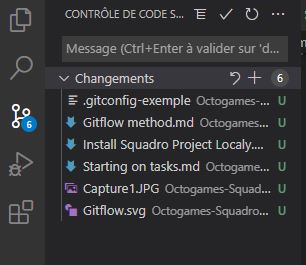
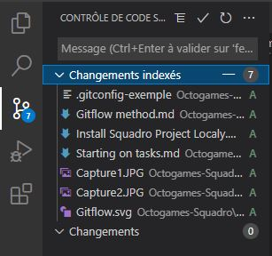
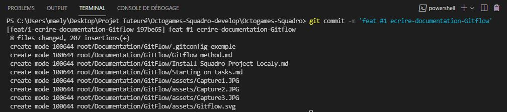
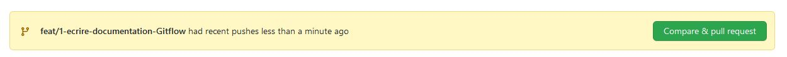
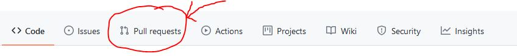
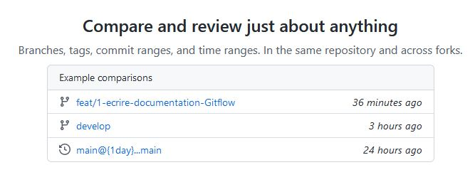
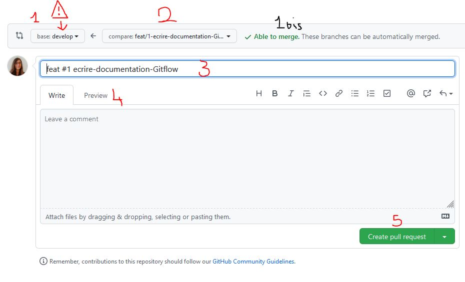
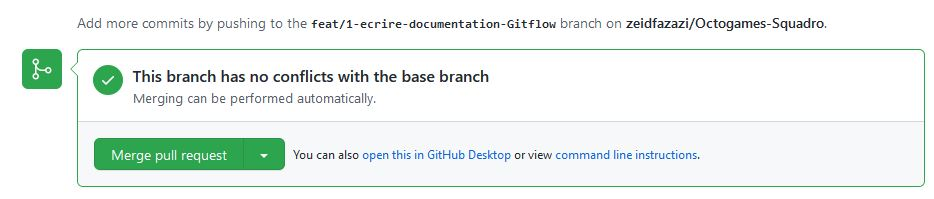
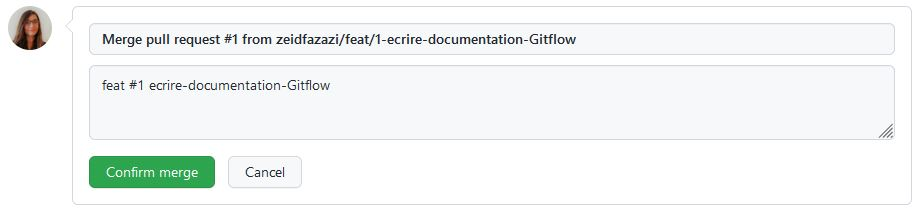

# Commencer des tâches

>*Assurez-vous d'avoir installé le projet localement avant de suivre ces indications*

### Les branches Gitflow

Conférer au document sur la [méthode Gitflow](./Gitflow%20method.md)

On rappellera ici que le développement s'effectue à partir de la **branche de develop**.

Vous devez, pour chaque nouvelle tâche:

[**1. Tirer une branche**](#1.tirer-une-branche)

**2. Développer sur cette branche**

[**3. Effectuer des commits**](#3.effectuer-des-commits)

[**4. Soumettre la branche à une *pull request***](#4.-soumettre-la-branche-à-une-pull-request)

[**5. Merger votre branche dans la develop**](#5.-merger-votre-branche-dans-la-develop)

[**6. Effectuer des rebase**](#6.-effectuer-des-rebase)

>La develop est régulièrement mergée dans la master(main)

<a name=1.tirer-une-branche></a>
### 1.Tirer une branche

On **crée une branche** à partir de la branche de develop

#### Procédure de nomenclature : 

*Proposition de nomenclature des branches, pas obligatoire mais plus efficace pour la compréhension*

Vous devez donner à vos branches un nom qui permet à vos collaborateurs d'identifier imédiatement la tâche.

On nomme la branche:

**<feat/fix/hotfix>/numéro-description**

###### Exemple:
Soit la tâche suivante.

> 14 [Feat][Front] Mettre du responsive sur toutes les pages

La branche tirée pour effectuer cette tâche pourra être nommée:
```
feat/14-responsive-toutes-pages
``` 

#### Tirer avec Git

Pour tirer une branche, on se place dans le terminal, sur la branche *develop* avec:

```
git checkout develop
```

On tire la develop:

```
git pull --rebase
```
>*L'option --rebase assure de récupérer le dernier commit de la develop*

On va pouvoir créer sa branche:
```
git checkout -b nom_de_la_branche
```
Vous êtes désormais sur votre branche. Vous pouvez développer!

<a name=3.effectuer-des-commits></a>
### 3.Effectuer des commits

Au cours du développement et lorsque vous voudrez soumettre votre travail, vous aurez à effectuer des **commits**. 
Un commit est une **soumission de votre travail sur votre branche.**
Vous pouvez en faire autant que vous voulez, c'est une **sauvegarde de la version actuelle** de vos fichiers.
L'avantage des commits est qu'ils sont conservés dans Github, et vous permettent de remonter le temps dans vos fichier en cas de problème (ou pour savoir qui a fait n'importe quoi dans ses devs ^^). 
> De nombreuses opérations existent pour manipuler les versions, ici on ne s'attardera que sur la méthode de commit de base (éventuelle documentation dédiée)

##### Méthode:
>*Les captures d'écran sont extraites de VSCode, mais les lignes de commande git restent rigoureusement identiques quel que soit l'IDE*

Dans l'onglet *Contrôle des sources*, vous pouvez voir vos modifications



Vous remarquerez que les fichiers modifés sont situés sous l'onglet *Changements*.

* Passez ces fichiers en *Changements indexés* (cela ajoute un nouveau noeud sur votre branche)
```
git add .
```
<p></p>



* Soumettre (**1er commit uniquement**)

```
git commit -m '<feat/fix/hotfix> #num description'
```

> *Il existe également des conventions de nommage pour les commits*
* Soumettre (**déjà un commit pour cette branche**)
```
git commit --amend --no-edit
```

Vos changements ont désormais été soumis dans votre commit.
<p></p>



Cependant, ces changements n'ont été notifiés que localement, il va falloir les **push sur Github**

* Pusher le commit
```
git push -f origin nom_de_votre_branche
```
>Vous aurez peut être une demande d'autentification lors du push. Dans ce cas, une fenêtre s'ouvre, le plus simple est d'accepter de s'identifier dans un moteur de recherche, et de suivre les instructions.

Désormais Github est notifié de vos changements, vous allez pouvoir effectuer une *pull request* directement sur le site. 

<a name=4.-soumettre-la-branche-à-une-pull-request></a>
### 4. Soumettre la branche à une *pull request*

Une **pull request** est une **demande d'autorisation pour merger** une branche dans une autre.
En l'occurence, vous effectuerez principalement des merges de vos branches dans la develop. 

Rendez-vous sur Github, dans le repos de Squadro.
* Si vous venez de pusher, cette popin apparait:
<p></p>



Cliquez sur **Compare and pull request**


* Sinon cliquez sur l'onglet **Pull Request**
<p></p>


<p></p>

puis cliquez sur **New pull request**

<p></p>


A partir de là, vous pourrez selectionner la branche que vous souhaitez merger.
<p></p>



La page de la pull request s'ouvre:
<p></p>



En tant normal, le remplissage est automatique. Néanmoins, vérifier que les champs numérotés soient bien remplis avec les informations suivantes:

**1. develop**

**2. votre branche**

**3. le nom du commit**

Ensuite:

**4. la preview, peut être vide**

**5. cliquez**

Votre pull request est créée! Plus qu'à attendre les commentaires et la validation de vos collègues. 
Dans les règles de l'art, **on attend la validation de 2 personnes pour merger**. Néanmoins dans le cadre du projet Squadro, des dérogations sont envisageables. 
Il est de plus nécessaire de [corriger les reviews](./Gitflow%20method.md/#3.review-(comments))

>Lors de vos prochain commits sur cette branche, plus besoin de faire de pull request, elle sera mise à jour par le push!

**Attention: cas particulier - 1bis**
La notification **Able to merge** indique l'absence de conflits avec la branche distante. Si l'un de vos collègues à mergé avant vous sur la develop, il est possible que vos développement entrent en conflit, auquel cas il va falloir [rebase](###-6.-Effectuer-des-rebase) votre branche. 

>Lorsque votre pull request est validé par deux de vos collègues et par un testeur, vous pouvez merger votre branche.

<a name=5.-merger-votre-branche-dans-la-develop></a>
### 5. Merger votre branche dans la develop

Pour merger votre branche dans la develop, cliquez sur **Merge pull request** dans l'onglet Conversation puis sur **Confirm Merge**.

<p></p>



<p></p>



Pensez à **prévenir vos collègues** du merge afin qu'ils puissent effectuer un rebase au plus tôt. 

<a name=6.-effectuer-des-rebase></a>
### 6. Effectuer des rebase

> Certaines des opérations suivantes nécessitent l'instalation de [Git Extension](https://sourceforge.net/projects/gitextensions/), notament le ```rebase --continue``` qui cherche à ouvrir un fichier d'information via un exécutable de l'extension. En cas de problème, n'hésitez pas à l'installer. 

Lorsqu'une branche est mergé dans la develop, il est nécessaire pour toutes les autres branches de **récupérer la version la plus récente de la develop** afin d'anticiper les conflits éventuels. 
Placez-vous sur la develop dans votre répertoire local, puis effectuez les commandes suivantes. 

```
git checkout develop
git pull --rebase
git checkout votre_branche
git rebase -i develop
```

Il est possible que ce **rebase donne lieu à des conflits** dans les fichier, arrêtant le rebase. 
**Dans ce cas:**

####Ne faites pas CTRL C !!!!!!!
> La commande est en pause, ce n'est pas un échec. 
Suivez la procédure suivante. 
1. Dans le contrôle des sources, ouvrez les fichiers en conflit. 
2. Résolvez les conflits (*Dans VsCode, tous les conflits sont encadrés et vous propose de choisir la version entrante ou sortante*) : à cette étape, c'est à vous de prendre des décisions quand au code le plus récent. 
3. Entrez:
```
git add .
git rebase --continue
```

En théorie ces opérations reprennent le rebase jusqu'à sa terminaison ou un prochain conflit. 

En cas de problème persistant, faire
```
git rebase --abort
```

Il peut arriver d'embarquer les commits d'autres personnes lors d'un rebase, dans ce cas, consulter la documentation sur la [gestion de version](./Gitflow%20method.md/#2.commits)


